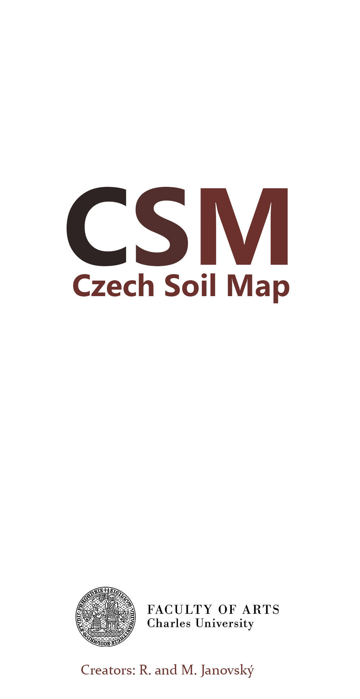
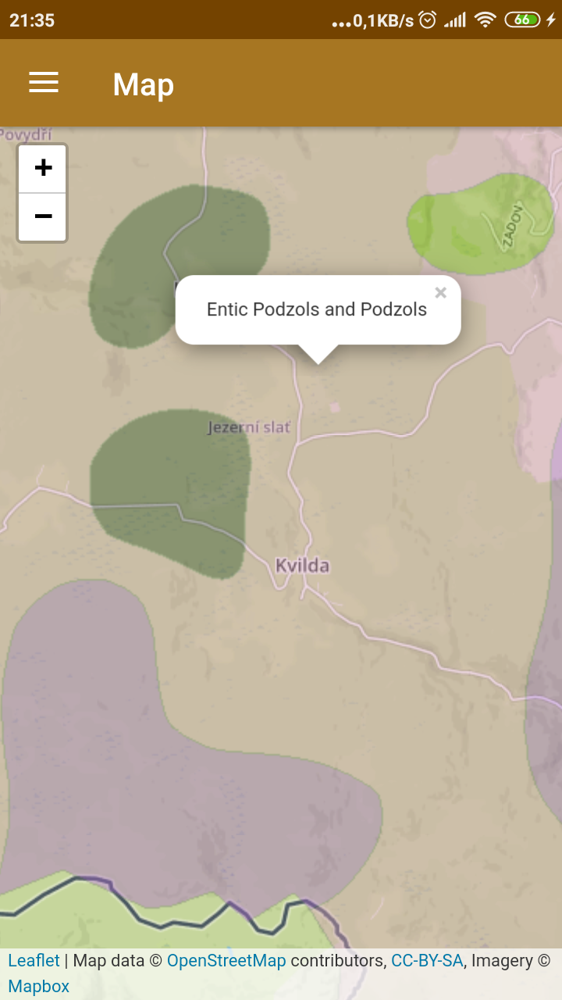
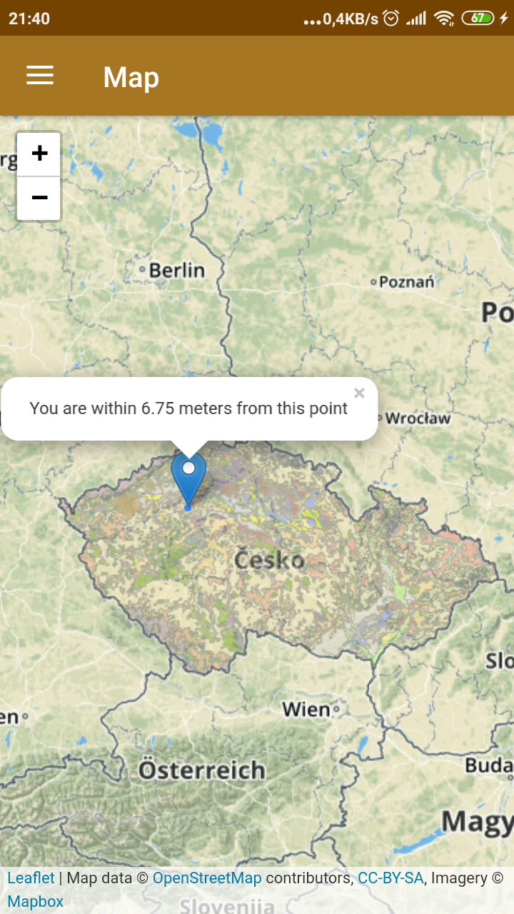

# CSM – Czech Soil Map

## Introduction

The app Czech Soil Map uses WMS service <a href= "http://www.geology.cz/extranet/mapy/mapy-online/wms">Soil Map 1 : 1 000 000</a> to show the soil type you are currently standing on.  
In the Soil list you can find the list of soils according to the wikipedia.org.

## Overview

## Download
You can download alpha version below:
 
<b>[Release](https://github.com/Barilac/CSM/releases)</b>

## Acknowledgment
This project was created at the Department of Archeology, Faculty of Arts, Charles University. 
Link to the websites: <i><a href="http://uprav.ff.cuni.cz">Department of Archaeology</a></i>
