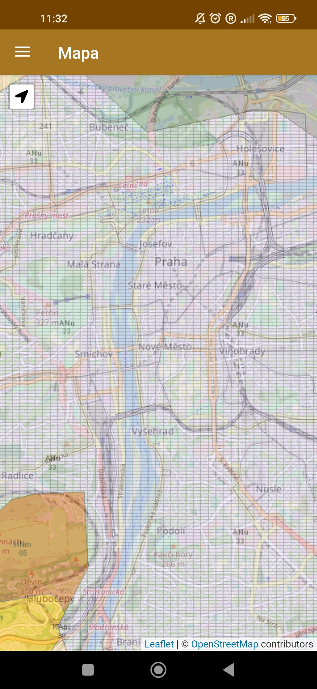
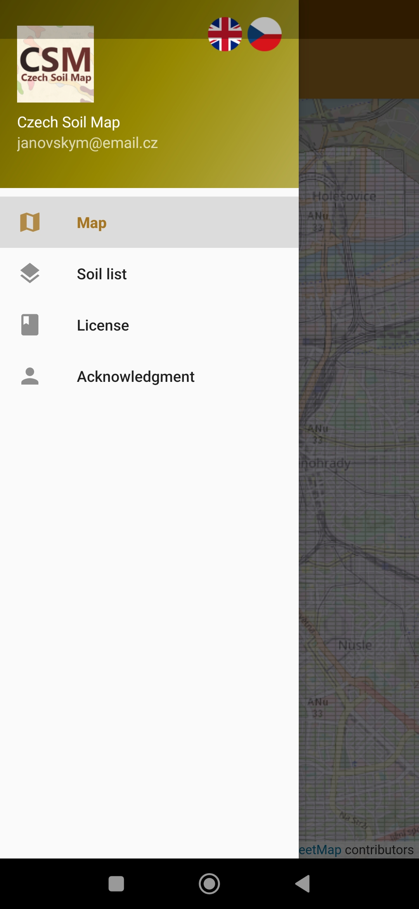
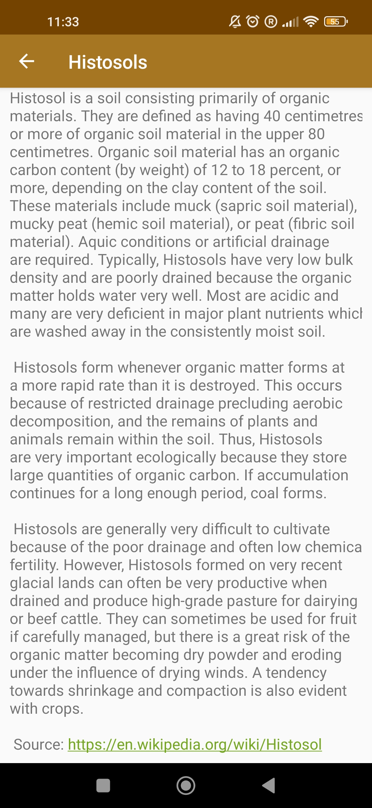
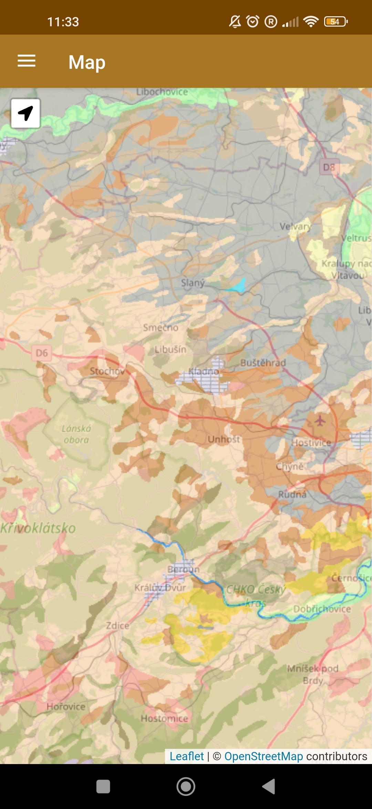

# CSM – Czech Soil Map

## Introduction

The app Czech Soil Map uses WMS service <a href= "https://geoportal.gov.cz/">Soil Map 1 : 250 000</a> to show the soil type you are currently standing on.  
In the Soil list you can find the list of soils according to the wikipedia.org. The application also allows you to determine the current position according to the locator. We combine <i><a href="https://leafletjs.com/">leaflet</a></i>  and WMS for active use in the field. Suitable for orientation when collecting soil and ecological samples.

## Overview

## Download
You can download alpha version below:
 
<b>[Release](https://github.com/Barilac/CSM/releases)</b>

## Acknowledgment
This project was created at the Department of Archeology, Faculty of Arts, Charles University. 
Link to the websites used to create the application: 
<i><a href="http://uprav.ff.cuni.cz">Department of Archaeology</a></i> 
<i><a href="http://geoportal.gov.cz">WMS layer: Národní geoportál INSPIRE</a></i> 
<i><a href="https://github.com/domoritz/leaflet-locatecontrol">Locate control</a></i>
